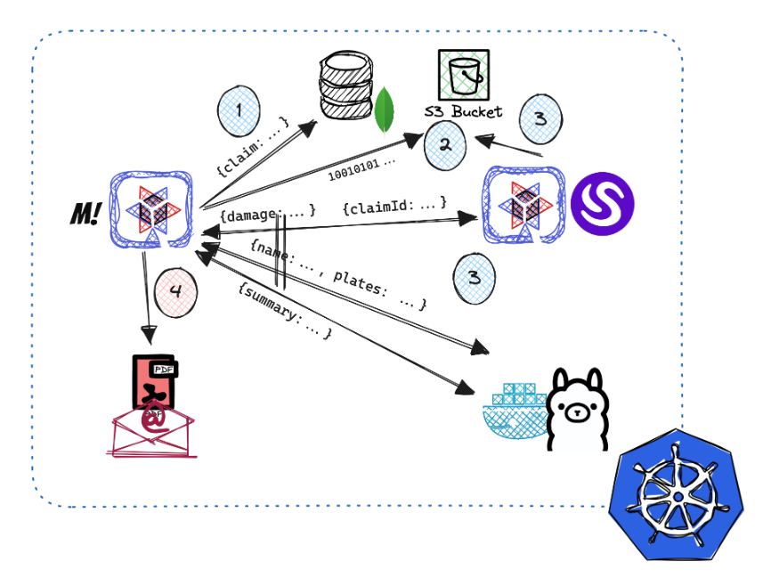

= Insurance Claim Processing

This example is based on https://rh-aiservices-bu.github.io/insurance-claim-processing/ but implemented in Java using Quarkus framework.

It uses MongoDB to store content and Minio to store images.

Interesting things:

* DJL processing images
* Using Jib with special base Java image with graphics libraries enabled
* Mutiny for sending parallel requests to two different models
* Langchain4J with ChatGPT or Llama

The following image shows the schema of the app:

== Deploying

To deploy this example, you can compile by your own, or use Kubernetes.

In `deployment` folder you'll find the `deploy_openshift.sh` script to deploy this solution to OpenShift. If you don't have an OpenShift cluster, we provide a free cloud OpenShift solution at https://developers.redhat.com/developer-sandbox

Or you can, adapt the YAMLs files easily by changing the OpenShift Route objects to Ingress objects.
